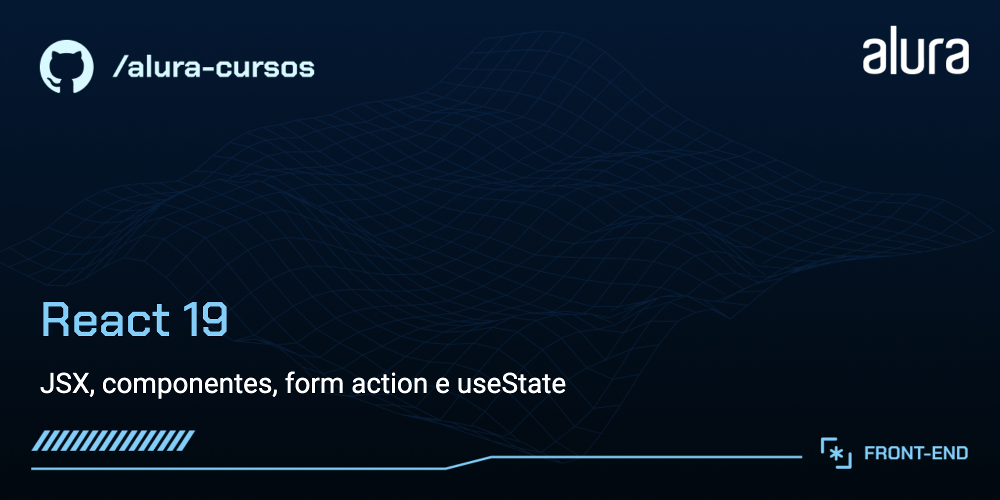

# Tecboard

Tecboard é um painel de eventos de tecnologia criado com React. O projeto permite cadastrar eventos com título, imagem de capa, data e tema, organizando os cards automaticamente por categoria.

Este repositório foi desenvolvido como portfólio de aprendizado em React, com foco em componentização, estado local, formulários e estilização com CSS.


## Funcionalidades

- Cadastro de eventos personalizados.
- Organização dos eventos por tema.
- Renderização condicional das seções que possuem eventos.
- Validação básica dos campos do formulário.
- Estado local com `useState`.
- Layout responsivo para a listagem de cards.

## Tecnologias Utilizadas

- React
- Vite
- JavaScript
- CSS
- ESLint

## Conceitos Praticados

- Criação e composição de componentes.
- Passagem de dados por `props`.
- Manipulação de formulários com `FormData`.
- Atualização de listas com estado imutável.
- Renderização de listas com `map` e `filter`.
- Renderização condicional.
- Organização de estilos por componente.

## Como Rodar o Projeto

1. Clone o repositório:

```bash
git clone https://github.com/seu-usuario/tecboard.git
cd tecboard
```

2. Instale as dependências:

```bash
npm install
```

3. Execute o projeto em modo de desenvolvimento:

```bash
npm run dev
```

4. Acesse no navegador:

```txt
http://localhost:5173
```

## Scripts Disponíveis

```bash
npm run dev
```

Inicia o servidor de desenvolvimento.

```bash
npm run build
```

Gera a versão de produção na pasta `dist`.

```bash
npm run preview
```

Executa uma prévia local da versão de produção.

```bash
npm run lint
```

Analisa o código com ESLint.

## Imagens de Exemplo

O projeto pode usar imagens públicas do repositório de assets abaixo:

```txt
https://raw.githubusercontent.com/viniciosneves/tecboard-assets/refs/heads/main/imagem_1.png
https://raw.githubusercontent.com/viniciosneves/tecboard-assets/refs/heads/main/imagem_extra_9.png
```

Estão disponíveis imagens no padrão `imagem_1.png` até `imagem_15.png` e `imagem_extra_1.png` até `imagem_extra_15.png`.

## Estrutura do Projeto

```txt
src/
  componentes/
    Banner/
    Botao/
    CampoDeEntrada/
    CampoDeFormulario/
    CardEvento/
    FormularioDeEvento/
    Label/
    ListaSuspensa/
    Tema/
    TituloFormulario/
  App.jsx
  main.jsx
```

## Aprendizados

Este projeto reforça fundamentos importantes do React, principalmente a criação de interfaces a partir de componentes reutilizáveis e a atualização da tela a partir de mudanças no estado da aplicação.

Como próximos passos, o projeto pode evoluir com persistência em `localStorage`, edição e remoção de eventos, filtros por tema e deploy em plataformas como Vercel ou Netlify.
